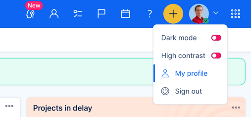
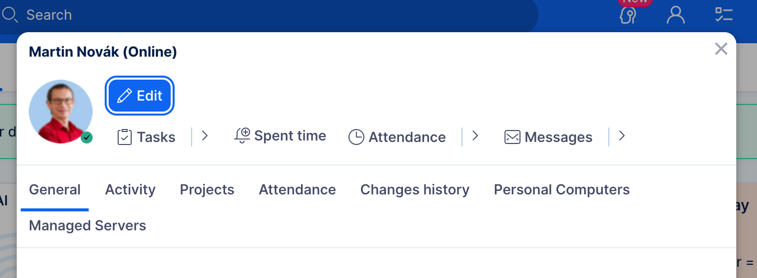
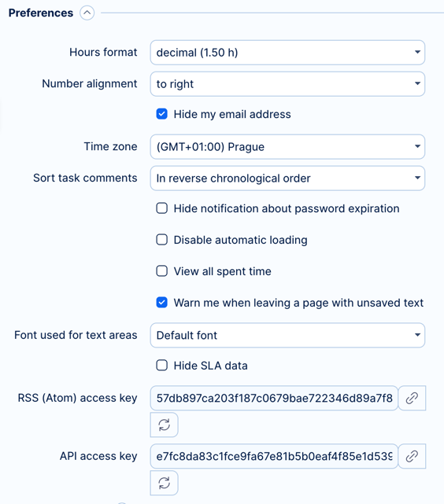

# Easy Redmine credentials and node for n8n

This repo contains n8n node for communication with Easy Redmine.

## How to install

### ⚙️ Requirements

To use our community node, you need to have the following requirements:

- n8n 1.54.4 or newer

### 🛠️ Installation in n8n

Follow the [installation guide](https://docs.n8n.io/integrations/community-nodes/installation/) to install the Easy Redmine node in n8n.

### 🔑 Setup credentials

You need to set up credentials for the Easy Redmine node.
You can do this by going to the credentials section in n8n and adding a new credential of type "Easy Redmine".

In the newly created credential, you need to fill in domain, and user api key.

The domain should be, for example, `https://instance.easyproject.com`.

To find the API key, go to your Easy Redmine instance, click on your profile in the top right corner.

Your profile window will open. Click on the "Edit" button.

Your profile edit page will open. Scroll down to the Preferences section. Here just copy the API access key.

Now, your credentials are ready to use.

## Easy Redmine node

The custom node is created to handle all aspects of Easy Redmine integration with n8n.
Currently available operations and resources are:

### Easy Redmine Entities

A list of all available entities in Easy Redmine node.

- Issues
- Leads
- Opportunities

### Easy Redmine Operations

Summary of Easy Redmine operations.

- **Get one** - returns a detailed view of a single entity. The entitiy is specified by its ID.
- **Get many** - returns a list of entities. You should use easy query id to specify the filter.
- **Add comment** - adds a comment to the entity.
- **Update** - updates some fields of the entity.

